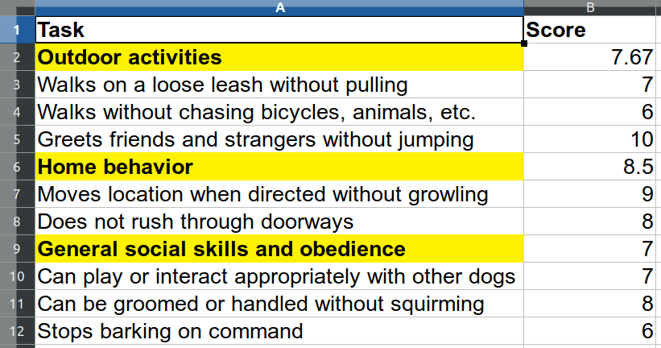

```{r setup, include = FALSE}
knitr::opts_chunk$set(
  collapse = TRUE,
  comment = "#>"
)
library(unheadr)
library(dplyr)
```

When we work with other people's data, we often have to struggle through multiple unexpected steps before we get to a flexible, usable structure. Popular ways of structuring and presenting data can place content beyond the reach of code-based routines to tackle repetitive tasks efficiently. 

## Package functions

The functions in `unheadr` help us rework data shared by other people, from a human-readable structure to a tidier machine-readable structure on which we can perform common data manipulation tasks.

### Data frames and tibbles

Here is how `unheadr` works with tibble and data frame objects that suffer from common issues such as:

* Embedded subheaders
* Broken values
* Merged cells and values wrapped within columns
* Broken rows

**Embedded subheaders** are usually grouping variables embedded into another variable, used to show hierarchical data or create small multiples of data.

A simple example would be a coffee shop menu:

```{r}
dat <- data.frame(
  drink = c(
    "Cold Drinks", "Soda", "Water", "Juice", "Lemonade",
    "Hot Drinks", "Tea", "Coffee"
  ),
  price = c(NA, 2.99, 1.99, 3.15, 2, NA, 3.99, 1.99), stringsAsFactors = FALSE
)

dat
```

The beverage type is embedded in the 'drinks' variable. If we can match them with regular expressions, we can move the grouping values into their own variable using `untangle2()`

```{r}
untangle2(dat,"Drinks$",drink,"beverage_type")
```


**Broken values** usually happen when we're pressed for space.

For whatever reason, the entries for the Barcelona 1992 and London 2012 Olympics are broken across two contiguous rows and NAs are used as padding in the other variables.

```{r}
OGames <- tibble(
  Games = c("Los Angeles 1984", "Barcelona", "1992", "Atlanta 1996", "Sydney 2000", "London", "2012"),
  Country = c("USA", "Spain", NA, "USA", "Australia", "UK", NA),
  Soccer_gold_medal = c("France", "Spain", NA, "Nigeria", "Cameroon", "Mexico", NA)
)
OGames
```

In this case, we can use `unbreak_vals()` to 'unbreak' the lines in the 'Games' variable, matching the strings that start with numbers.

```{r}
OGames %>% 
unbreak_vals("^[0-9]", Games, Games_unbroken,.slice_groups = TRUE) %>%
  select(Games_unbroken, everything())
```


**Wrapped columns** often happen when we merge cells in spreadsheets or use table formatting in a word processor, resulting in empty or NA values used to pad all the vertical space. 

```{r}
knicks <- data.frame(
  stringsAsFactors = FALSE,
  player = c("Allan Houston", NA, "Latrell Sprewell", NA, NA),
  teams= c(
    "Pistons", "Knicks", "Warriors", "Knicks",
    "Timberwolves"
  ),
  position = c("Shooting guard", NA, "Small forward", NA, NA)
)
knicks
```

We can unwrap the 'teams' values into a single string using `unrwap_cols()`.

```{r}
knicks %>% unwrap_cols(groupingVar = player, separator = ", ")
```

This is more or less the opposite to `separate_rows()` from `tidyr`.  

  
**Broken rows** have values of two contiguous rows broken up and padded with empty or NA values.

```{r}
basketball <-
  data.frame(
    stringsAsFactors = FALSE,
    v1 = c(
      "Player", NA, "Sleve McDichael", "Dean Wesrey",
      "Karl Dandleton", "Mike Sernandez",
      "Glenallen Mixon", "Rey McSriff"
    ),
    v2 = c(
      "Most points", "in a game", "55", "43", "41", "111", "109", "104"
    ),
    v3 = c(
      "Season", "(year ending)", "2001", "2000", "2002",
      "2000", "2002", "2001"
    )
  )
basketball
```

In this case, we can match any value in any variable along the row that has broken values.

```{r}
unbreak_rows(basketball, "^Most", v2)
```

### Spreadsheets

`unheadr` also includes a function for flattening font and cell formatting in spreadsheet files into character strings in the corresponding cell.

The example file bundled with the `unheadr` looks like this:



Font formatting and cell highlighting is being used to label an embedded grouping variable (meaningful formatting). The `annotate_mf()` function flattens the formatting into a character string describing the formatting. The HTML code of the colors used for cell highlighting is also included.

```{r}
example_spreadsheet <- system.file("extdata/dog_test.xlsx", package = "unheadr")
annotate_mf(example_spreadsheet,orig = Task, new=Task_annotated)
```


## Further reading

The underlying reasoning, background, and possible uses of `unheadr` are now described in this publication:

Verde Arregoitia, L. D., Cooper, N., D'El&#237;a, G. (2018). Good practices for sharing analysis-ready data in mammalogy and biodiversity research. _Hystrix, the Italian Journal of Mammalogy_, 29(2), 155-161. [Open Access, DOI 10.4404/hystrix-00133-2018](https://doi.org/10.4404/hystrix-00133-2018)
